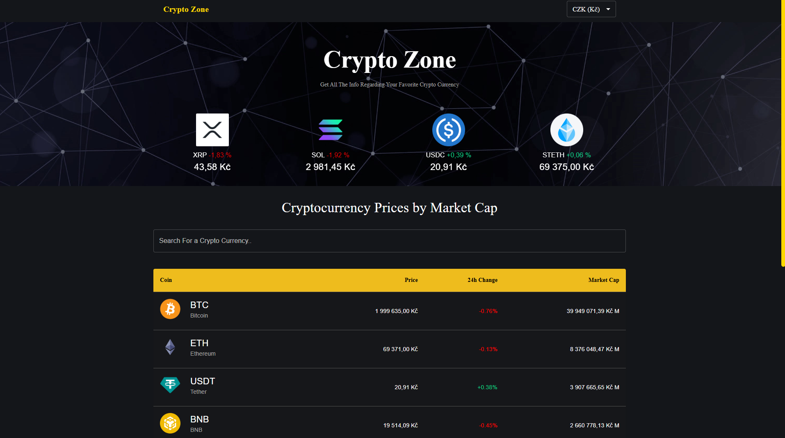

# Crypto Zone 

A modern Cryptocurrency Tracker built to practice and master **React 19**, **MUI v6**, and **Vite**.

### Developer: **Lenka Kopečná**
*Junior Front-End Developer*

---
 **Status: Training Project (Work in Progress)**
This project is a personal learning milestone. I am currently focusing on:
- Migrating legacy code to **React 19** standards.
- Mastering the **MUI v6** Theme system.
- Handling real-time API data and complex charting logic.
- Improving performance using **Vite**.

---
MIT © 2026 Lenka Kopečná
